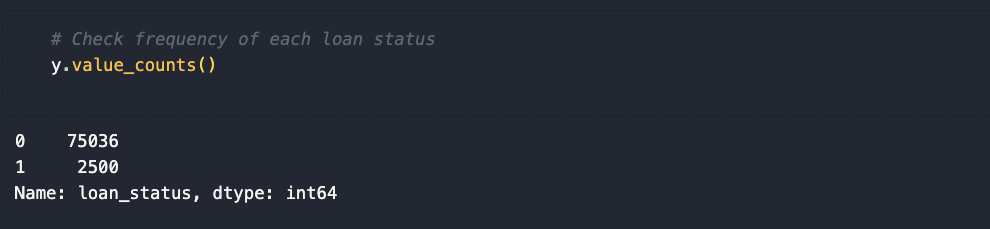
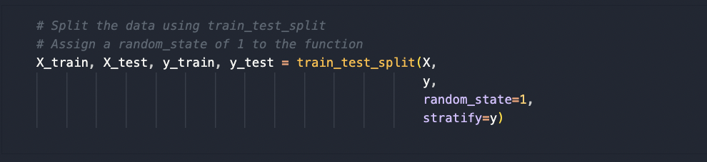
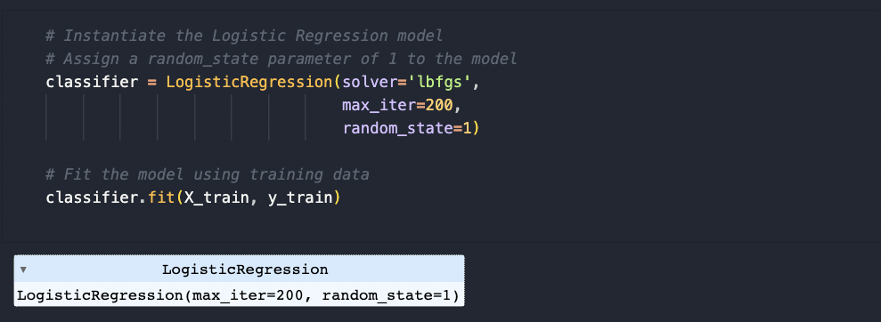
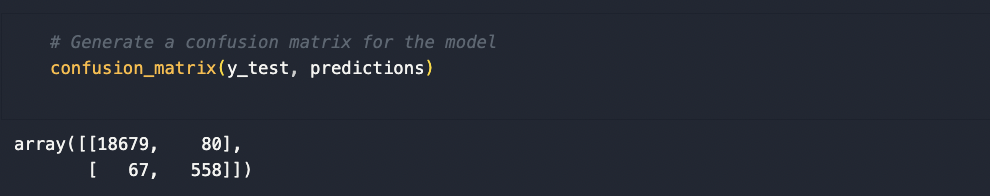
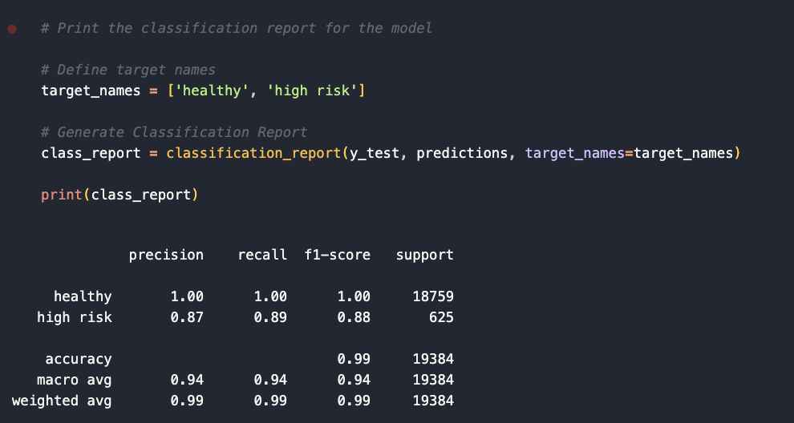

# Credit Risk Analysis Report

Overview of Supervised Machine Learning Logistic Regression Model that predicts loan risk based on various features from customers of a peer-to-peer lending services company.

Created and submitted for an assignment for Monash University Data Analytics Boot Camp (October 2023).

## Table of Contents

- [Overview of the Analysis](#overview-of-the-analysis)
- [Results](#results)
- [Summary](#summary)

## Overview of the Analysis

### Purpose

- The purpose of this analysis is to predict whether customer loans of a peer-to-peer lending services company are 'healthy' or are at a 'high risk' of defaulting based on various customer features/attributes. 
- This supervised machine learning logistic regression model could help to increase the company's bottom line by correctly predicting 'high risk' loans prior to defaulting.

### Features Required

- The model sought to correctly predict whether a loan was 'healthy' or 'high risk' based on the customer's financial information/features including:
  - Loan size
  - Interest rate
  - Borrower income
  - Debt to income ratio
  - Number of accounts
  - Derogatory marks
  - Total debt

### Target/Predicted Variables

- The predicted variable was loan status, that could be classified as either `healthy (0)` or `high risk (1)`. 

- The `value_counts()` function revealed that the dataset was imbalanced, with ~75,000 `healthy (0)` loans and only 2,500 `high risk (1)` loans. 

  

### Machine Learning Stages

1. Read in data as Python Pandas DataFrame.
2. Create discrete variables for:
   - Labels (y): the target or predicted variable.
   - Features (X): the variables used to predict y.
3. Split Features (X) and Labels (y) further into Training and Test data using `train_test_split()` module from machine learning library `scikit-learn`:
   - Training data (75 % of the total dataset):
     - `X_train`: Features data used to train the model.
     - `y_train`: Labels data used to train the model.
   - Test Data (25 % of the total dataset):
     - `X_test`: Features data used to test the model.
     - `y_test`: Labels data used to tes the model.
4. Use `LogisticRegression()` function from `scikit-learn` and `lbfgs solver` to fit and train the model using `X_train` and `y_train` data.
5. Use the results of the training predictions to test the test data (`X_test`).
6. Generate a Confusion Matrix using the `confusion_matrix()` function to compare actual test results (`y_test`) with the predicted values.
7. Generate a Classification Report using the `classification_report()` function to assess the Precision, Recall, F1-Score and Accuracy of the model.
   

### Methods

- The Features (X) and Labels (y) were split into train and test data using `train_test_split()` function:
  

- The `LogisticRegression()` function was used to fit and train the model using `X_train` and `y_train` data:
  

- The predictions from the model were compared to `y_test` Labelled data using the `confusion_matrix()` function:
  

- The `classification_report()` function was used to calculate the Precision, Recall, F1-Score and Accuracy of the model:
  

## Results

- <b>Precision</b> is a measure of both True and False Positive rates. 
  - <b>Healthy</b> loan classification had a precision score of `1` or `100 %`. This means that the model returned negligible False Positive results; only `67 of 18746 predictions (0.35% - rounded down to 0)` loans were classified as 'healthy' when they were actually 'high risk'.
  - <b>High Risk</b> loan classification had a precision score of `0.87` or `87 %`. This suggests that 13 % of healthy loans were erroneously classified as high risk. In this case, misclassifying a healthy loan as high risk could result in decreased customer satisfaction.

- <b>Recall</b>, also known as Sensitivity, is a measure of positive class observations. Recall takes into account the True Positive and False Negative rates from the model. 
  - <b>Healthy</b> loan classification had a recall score of `1` or `100 %`, which indicates that the model made negligible False Negative predictions.

  - <b>High Risk</b> loan classification had a recall score of `0.89` or `89 %`. This suggests that 11 % of loan status predictions erroneously classified high risk loans as healthy loans. This is problematic, as incorrectly classifying a high risk loan as healthy could result in the customer eventually defaulting on their loan, which in turn would negatively affect the company's bottom line.

- <b>F1-Score</b> is the harmonic mean of the Precision and Recall scores. In this respect, the F1-Score reflects the balance of False Positive and False Negative rates, which are measured by Precision and Recall, respectively. 
  - <b>Healthy</b> loan classifications had an F1-Score of `1`, which is the maximum score.

  - <b>High Risk</b> loan classifications had an F1-Score of `0.89` or `89 %`, which is the mean of precision and recall scores.

- <b>Accuracy</b> is a measure of the overall accuracy of the model, as such it takes into account all components of the Confusion Matrix (True Positives, True Negatives, False Positives and False Negatives). For balanced classes, accuracy is a good measure. However, for imbalanced classes, such as this one (there are far more 'healthy loan' outcomes than 'high risk loan' outcomes), accuracy is not an approrpriate metric to assess the model. While the model predicted the correct outcome for 'healthy loans' almost perfectly, the same was not true for 'high risk loans'. As such, the accuracy score of `0.99` or `99 %` was skewed by the dominant outcome.
- Labelled Confusion Matrix results:
  
- Classification Report:
  

## Summary 

The logistic regression model described here was highly capable of correctly predicting 'healthy' loans. While this model was not as capable at predicting 'high risk' loans, it performed sufficiently well to deploy the model large-scale. In this particular use case, the most important overall score is recall. A low 'high risk' loan recall score would result in the classification of many 'high risk' loans as 'healthy', which could negatively affect the company's bottom line as these customer's could be at risk of defaulting on their loan.