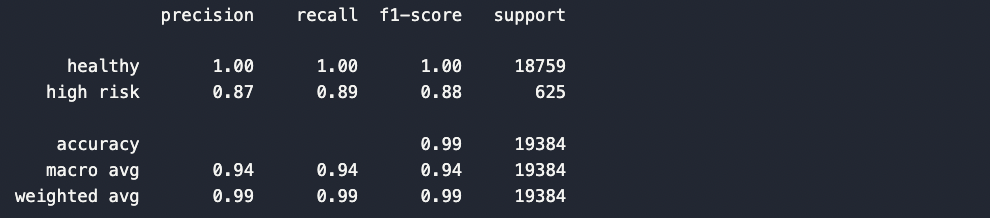

# Supervised Machine Learning Challenge

Use a Python-based Supervised Machine Learning Logistic Regression Model to predict loan risk based on various features from customers of a peer-to-peer lending services company.

Created and submitted for an assignment for Monash University Data Analytics Boot Camp (October 2023).


## Table of Contents

- [General info](#general-info)
- [Question and Answer](#question-and-answer)
- [Technologies](#technologies)
- [Screenshots](#screenshots)
- [Code example](#code-example)
- [References](#references)

## General info

### credit_risk_classification.ipynb

- Reads in data as Python Pandas DataFrame.
- Creates discrete variables for:
  - Labels (y): the target or predicted variable.
  - Features (X): the variables used to predict y.
- Splits Features (X) and Labels (y) further into Training and Test data using `train_test_split()` module from machine learning library `scikit-learn`:
  - Training data (75 % of the total dataset):
    - `X_train`: Features data used to train the model.
    - `y_train`: Labels data used to train the model.
  - Test Data (25 % of the total dataset):
    - `X_test`: Features data used to test the model.
    - `y_test`: Labels data used to tes the model.
- Uses `LogisticRegression()` function from `scikit-learn` and `lbfgs solver` to fit and train the model using `X_train` and `y_train` data.
- Uses the results of the training predictions to test the test data (`X_test`).
- Generates a Confusion Matrix using the `confusion_matrix()` function to compare actual test results (`y_test`) with the predicted values.
- Generates a Classification Report using the `classification_report()` function to assess the Precision, Recall, F1-Score and Accuracy of the model.

### credit_risk_analysis_report.md

- Describes the purpose of the analysis.
- Describes the financial information (or features) the model used to make predictions.
- Provides information about the predicted (target) variables.
- Describes the stages of the machine learning process used in this analysis.
- Lists and briefly outlines the machine learning methods and functions employed.
- Discusses the results and implications of the analysis.
- Summarises the analysis.


### Resources Folder

- Contains: 
  - Raw data: `lending_data.csv`
  - Various screenshots of code and code output.

## Question and Answer

- #### How well does the logistic regression model predict both the `0` (healthy loan) and `1` (high-risk loan) labels?

- This logistic regression model has an <b>accuracy</b> score of `99 %`. For balanced datasets, accuracy is a good measure. However, accuracy is heavily skewed by dominant classes of imbalanced datasets. In this model, there are far more 'healthy' loans than 'high risk' loans, as such the dataset is imbalanced and therefore accuracy is not a good metric to gauge the model. 

  For this reason, <b>precision</b>, which measures both True and False Positive rates, and <b>recall</b>, which measures True Positive and False Negative rates, are more informative of a model's reliability. For 'healthy' loans, precision, recall and F1-Score (harmonic mean of precision and recall) were the maximum score of `1`, which suggests that the model could accurately predict 'healthy' loans (almost) `100 %` of the time. However, this was not the case for 'high risk' loans, where precision and recall scores were `87 %` and `89 %`, respectively, 

  From a business standpoint, a high precision score for 'high risk' loans could help to preserve or increase customer satisfaction by minimising the misclassification of 'healthy' loans as 'high risk', whereas a high recall score could help the business avoid financial loss by minimising the misclassification of 'high risk' loans as 'healthy'.

  Overall, this logisitic regression model is well-suited to predicting 'healthy' loans, but is not quite as capable of correctly predicting 'high risk'. That aside, this model performs well enough to deploy large-scale.

## Technologies

Project created and run using:

- Python 3.10.9
  - Pandas 1.5.3
  - NumPy 1.24.3
  - Scikit-Learn 1.3.0
- Visual Studio Code 1.83.0


## Screenshots

#### Confusion Matrix


#### Classification Report


## Code example

```python
## Code Snippet from credit_risk_classification.ipynb
#################################################

# Import the train_test_learn module
from sklearn.model_selection import train_test_split

# Split the data using train_test_split
# Assign a random_state of 1 to the function
X_train, X_test, y_train, y_test = train_test_split(X,
                                                    y,
                                                    random_state=1,
                                                    stratify=y)

# Import the LogisticRegression module from SKLearn
from sklearn.linear_model import LogisticRegression

# Instantiate the Logistic Regression model
# Assign a random_state parameter of 1 to the model
classifier = LogisticRegression(solver='lbfgs',
                                max_iter=200,
                                random_state=1)

# Fit the model using training data
classifier.fit(X_train, y_train)
```

## References

- Code, in general, was adapted from Monash University Data Analytics Boot Camp 2023 course learning material.

Created and written by Samuel Palframan - October 2023.
